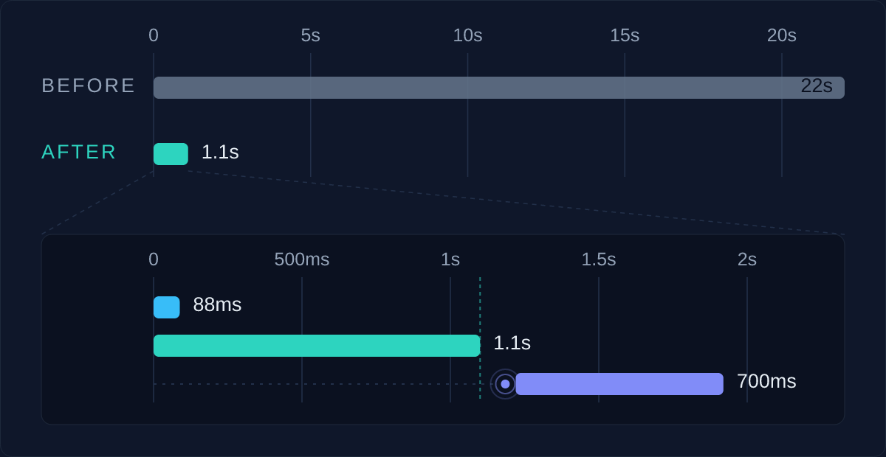

There is a precise moment when that page gets opened. Not out of curiosity and not at random: a warning has arrived, by email or by text, saying there is something to deal with. Whoever gets it signs into the system and goes straight there, because that is the page where you see what is going on and decide what to do.

For the customer with the largest volume, tens of thousands of monitored accounts, that page took twenty-two seconds on average to appear. Not to respond: to appear. Before that moment there was nothing to look at, because it loaded everything it needed in full and only drew itself at the end.

Twenty-two seconds are a lot anywhere. But slowness in itself is not the point yet: what matters is where it landed. It landed on someone who had just been warned about a problem that needed solving right away.

The code behind that page was old. It had been written by people who are no longer with the company, there was no documentation, and you could tell how it was built at a glance: a chain of queries that pulled from five to eight tables depending on the type of notification, reading very large slices of each one only to throw away downstream almost everything it had just read.

The comfortable version of this story ends here: I found somebody else's mess and I cleaned it up. It is also the least useful version, and it is not entirely true.

Because the decision underneath the mess, load everything I need and then draw, was not absurd. On a small customer that page opened in an instant, and there was nothing to fix. Nobody broke it: it stayed exactly the same while the order of magnitude around it changed. There is no wrong commit to point at, and that is the uncomfortable part. Some decisions are not born wrong. They become wrong on their own, quietly, while nobody is looking at them.

So when I sat down with it, the obvious question was a single one: how do I make this faster? That is the question I did not ask.

"How do I make this faster" is a question that always takes you to the same place: into the queries. And the time really was there: of those twenty-two seconds, seventeen were queries. That is what makes the trap convincing. You profile them, add an index, rewrite a join, and with some work you take five or six seconds off. It would have been a result. And the page would have stayed unusable.

What stopped me was a number that did not add up. On that customer, the configured notifications were seventeen. Seventeen rows to draw, twenty-two seconds to draw them. Whatever was costing all that time, it was not the amount of information to display: it was the depth each one was digging to.

So I dropped the speed question and went to look at what actually happens on that page. Whoever opens it does not have one question: they have three.

The first one is "is something wrong", and it is the question you walk in with: how many accounts am I watching, how many have crossed the early warning threshold, how many have used up what they had available, how many notifications have I not dealt with yet. They are numbers, you read them at a glance, and they are not there to do anything with: they are there to decide whether to worry.

The second one is "where", and it is the panels: for each configured notification, what it watches and how many accounts are over the threshold right now. It is there to choose where to start.

The third one is "so what do I do now", and it is everything that shows up inside a notification when you open it: the thresholds, the timings, the list of accounts near the limit and the ones past it, the actions to apply to each. This is the heavy part. And it is also the only one that concerns one notification at a time, the one the warning sent you to look at.

Three questions, three moments, three purposes. And a single chain of queries answering all of them at once, as if they were the same thing, for every notification, before showing anything at all. The time was not going into a badly written query. It was going into answering in advance, and for everybody, questions nobody had asked yet.

It was not a performance problem, it was a domain problem. That page was not slow, it was undifferentiated.

It is the same way of looking at things as the [previous piece](/en/blog/the-fine-line-of-code), turned around. There I had mapped a domain halfway, I had forgotten that notifications do not just fire but also renew, and the missing piece came back to me at the end of the month in the shape of a failure. Here the whole domain was there, but it sat in a single block: three different things held together by one function. In the first case I paid for it with a bug. In the second, with twenty-two seconds.

From there on the work was almost mechanical, and it is the part that usually gets told first.

Three separate questions want three separate answers: three queries in the backend, each built for its own, and three different ways of asking for them from the frontend. At that point the temptation was to reuse the aggregations that already existed, adapting them. I chose not to, and to write three targeted queries instead, each with only the tables it actually needs: from eight joins to answer everything down to three for each sub domain, and the filters moved upstream, so every query now carries a fraction of the data it used to read, instead of discarding it after reading it.

I know what this choice costs. Three specialised queries are three places to update when the model changes, while the generic one was a single place: I accepted duplication in exchange for selectivity. Reuse is a principle, and it is one of the good ones. But principles exist for a reason, and part of the craft is knowing when to bend them without losing sight of the result you are bending them for. Here the result was a page that opened in time for someone who had just been warned, and no reusable aggregation was getting there.

On the frontend the three answers became three moments. The first two start together when the page opens: the general statistics come back in 88 milliseconds, the aggregated notification data in a little over a second, and the page is ready as soon as the slower of the two arrives. The third one does not start at all until it is needed. When you open a notification, and only that one, its details and its accounts arrive, another seven hundred milliseconds. If you close it and open it again, what you had is still there.

*The two bars at the top are on the same scale: the comparison is there for the naked eye. The inset magnifies that first second.*

Twenty-two seconds turned into a little over one.

And this is where the number deserves a closer look, because written like that it lies by omission.

Twenty-two seconds did not become one: they were moved. Whoever opens a notification pays another seven hundred milliseconds, and pays them again for every one they open. The time did not disappear, it changed place, and it ended up where the person waiting accepts it, because it is the consequence of something they just asked for. Twenty-two seconds in front of an empty page are a wait you suffer. Seven hundred milliseconds after a click are an answer. The amount matters less than where it falls.

I asked myself whether the new version loses in the worst case, that is, if somebody really opened all of them. On that customer the notifications are seventeen: opening them one by one costs a little under twelve seconds, which added to the initial load makes thirteen against the twenty-two of before. It holds up there too, and that was not obvious at all.

I did lose something, though, and it is not time. With the single load, an account's usage was read once and served every notification watching it. Now I read it again for each notification that gets opened: if the same account is watched by three notifications and I open all three, I read that data three times. It is the same choice as the targeted queries, repeated one level up: I accept doing work twice rather than doing it in advance for everybody.

And I lost something subtler. Before, everything you saw on the screen was photographed at the same instant. Now every open notification has its own age: if I open one at ten and another at six past ten, two different snapshots live side by side on the same screen. The data stays valid for five minutes, which is not a number picked at random but the maximum frequency at which those values change: the cache can never show more than one generation of delay. And every manual action is validated by the backend against the current state, never against whatever the frontend is holding. What is left is a visual mismatch, limited and declared, not the risk of acting on the wrong data.

One last thing about the numbers, because a case study that does not state the perimeter of its data is worth little. The precise measurements come from one customer only, the one with the largest volume: browser timings for the page load, log timestamps for the queries, averages over repeated runs. On a customer with the opposite profile, almost a hundred notifications but very few accounts each, the page was already loading in five to seven seconds and came down to the order of hundreds of milliseconds. I did not measure that second one with the same rigour, and I give it as an order of magnitude, not as a result.

There is a part missing that in a piece like this usually comes first: how much of all this was generated by AI.

Of the work that produced the result, almost none. I wrote the queries by hand, one at a time. Not out of distrust: because the value was not in writing them, it was in deciding where to cut, and deciding required knowing what the person opening that page needs, and in what order. I had the domain in my head; once the cut was clear, the targeted changes cost me very little time.

There is a more concrete reason too, and it is the same one as in the previous piece. That code was old, scattered across dozens of classes, undocumented, written by people who are no longer here. To get help I would have had to hand the AI a context that did not exist: I would have had to rebuild it first, and rebuilding it was already the bulk of the work. It is not that the machine could not answer. It is that the right question could only be formed after understanding, and whoever has understood is, by that point, almost done.

Where it did help, and a lot, is in the refactor of the frontend components, which I had it carry forward while I worked on the queries. That is work that depends on decisions already made: the boundaries were set, the three domains decided, what remained was reorganising code around them. There the AI runs, and I did two things at once.

And it helped at the end, with something I had promised myself in the previous piece: the documentation for that module, which had never existed, I had it written starting from my commit. It arrived afterwards, to make transmissible something I had already understood. That order is not accidental: it is the only one in which it could work.

I could have had the AI analyse the code, optimise the queries and walk away with a few seconds. It would have been a real, measurable improvement, and the problem would have stayed where it was: a bit smaller, just as cumbersome.

I took the uncomfortable route, which was working out what domain the user actually meets, instead of accepting the one somebody had defined years earlier. From there I could redraw the perimeter of what that page does and when it does it. The bottleneck we had been carrying around for years, I did not shrink it: I took it apart into the three pieces it was made of.

AI is faster than me and misses fewer details than me. But it can only read a domain as it is, not as it should be. And the difference between those two things is exactly the difference between waiting twenty-two seconds and waiting one.

---

*The opinions and experiences shared in this article are my own and do not represent official positions of my employer. The cases described are deliberately generic and anonymised, for the purpose of sharing knowledge.*
